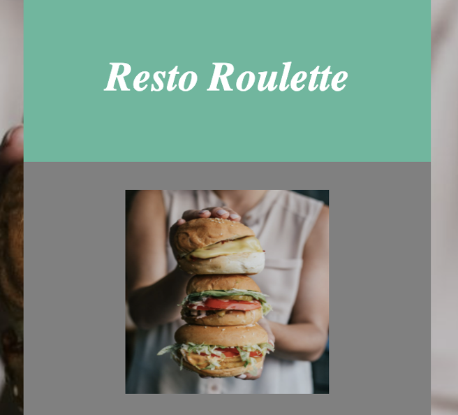
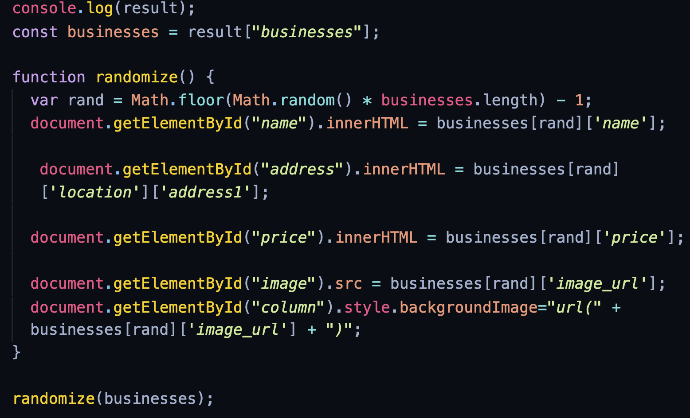
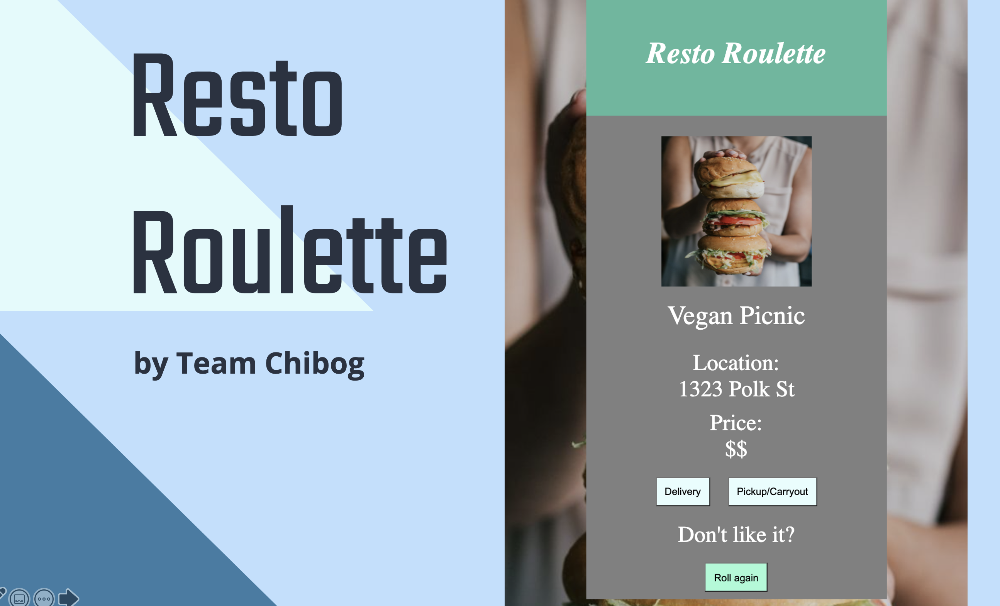

<head>
  <base href="">
</head>

 

&nbsp;

# **Overview**
This app was created to automatically pick a restaurant for the user. On average, an American couple spends 132 hours each year deciding where to eat. That is almost 6 days each year! With the use of this app, not only are we hoping to decrease the time each person spends choosing a restaurant, but we’re also adding an element of surprise to the process, as the restaurants are picked at random based on the user’s location

This app uses HTML, CSS and Javascript to have a random restaurant picker.

---
## **Technologies**
This project leverages the following libraries:

### Javascript 
### CSS
### HTML
### JSON
### Yelp! API
### Postman
### Codepen
### Replit

---
## **Examples**

---

## **Usages**
1. The user will be able to interact with the app once they plug in the website link. They'll receive a random restaurant based on their location. If the user didn't like the restaurant picked, then the user can re-generate it with clicking `Roll again`.

---

## **Contributors**

### CodeDay Team Chibog

#### Justine Cho  &nbsp;&nbsp;&nbsp;| &nbsp;&nbsp;&nbsp; Clark Ngo  &nbsp;&nbsp;&nbsp;| &nbsp;&nbsp;&nbsp; Mary Reyes  &nbsp;&nbsp;&nbsp;| &nbsp;&nbsp;&nbsp; Elizabeth Xu  

---

## **Deck**

Click [HERE](./deck/RestoRoulette_deck.pdf) to learn more from our presentation.

---

## **License**

### MIT License

Copyright (c) [2021] [CodeDay Team Chibog: Justine Cho | Clark Ngo | Mary Reyes | Elizabeth Xu]

Permission is hereby granted, free of charge, to any person obtaining a copy
of this software and associated documentation files (the "Software"), to deal
in the Software without restriction, including without limitation the rights
to use, copy, modify, merge, publish, distribute, sublicense, and/or sell
copies of the Software, and to permit persons to whom the Software is
furnished to do so, subject to the following conditions:

The above copyright notice and this permission notice shall be included in all
copies or substantial portions of the Software.

THE SOFTWARE IS PROVIDED "AS IS", WITHOUT WARRANTY OF ANY KIND, EXPRESS OR
IMPLIED, INCLUDING BUT NOT LIMITED TO THE WARRANTIES OF MERCHANTABILITY,
FITNESS FOR A PARTICULAR PURPOSE AND NONINFRINGEMENT. IN NO EVENT SHALL THE
AUTHORS OR COPYRIGHT HOLDERS BE LIABLE FOR ANY CLAIM, DAMAGES OR OTHER
LIABILITY, WHETHER IN AN ACTION OF CONTRACT, TORT OR OTHERWISE, ARISING FROM,
OUT OF OR IN CONNECTION WITH THE SOFTWARE OR THE USE OR OTHER DEALINGS IN THE
SOFTWARE.
